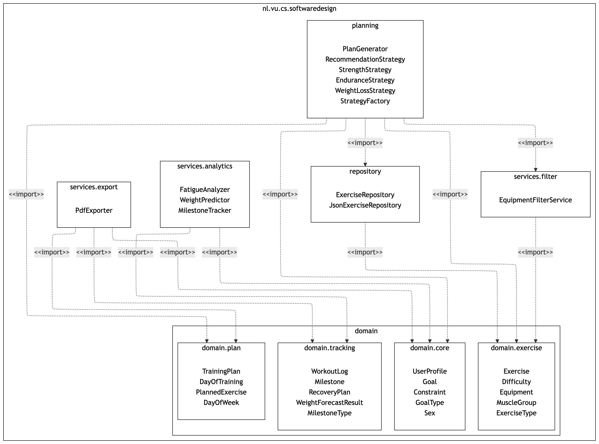

# Software Design 
This is the template for the team project of the Software Design course at the Vrije Universiteit Amsterdam. 

## IMPORTANT NOTE FOR GRADING (Final Implementation Updates)
This final version specifically addresses the architectural and dynamic requirements missing in previous versions:

The updated package diagram:

The updated class diagram:

### 1. Design Pattern Rationale (Addressing Extensibility)
* **Factory & Strategy Patterns (`StrategyFactory.java` & `RecommendationStrategy.java`):** Rather than using rigid `if/else` statements in the core engine, we implemented a Factory that delegates plan generation to specific Strategy classes (`StrengthStrategy`, `WeightLossStrategy`, `EnduranceStrategy`).
* **Rationale:** This satisfies the Open/Closed Principle; if a new goal type is added in the future, we simply add a new Strategy class without modifying the core `PlanGenerator`.
* **Repository Pattern (`JsonExerciseRepository.java`):**
* **Rationale:** This completely decouples the JSON file I/O from the domain logic. By injecting this abstraction, if we migrate to a certain database tomorrow, say SQL, or non-relational, the core planning engine remains completely untouched.

### 2. Adaptive Behavior & Dynamic Tracking (Addressing Missing Functionality)
* **Dynamic Constraint Adjustment:** The system now genuinely adapts to user feedback without any hardcoded simulations. Check `Main.java` and `FatigueAnalyzer.java`. The system accepts real user input for fatigue, sleep, and stress at the end of the week. If high fatigue is detected, it programmatically triggers `user.getConstraint().reduceTrainingDays();` and dynamically regenerates a recovery-focused PDF.
* **Milestone Tracking (Feature 5):** The system dynamically evaluates user progress based on their completed sessions and awards corresponding badges (`MilestoneTracker.java`), fully implementing the promised tracking feature.

There were few more adjustments that were not mentioned here, however, in the document submitted it can be partially or fully detailed.

